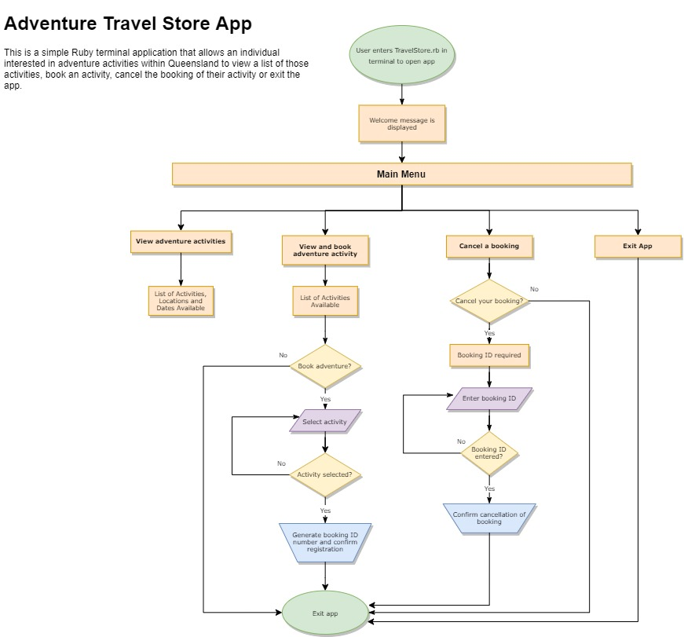

# T1A3 - Terminal Application

## R4. Provide a link to your source control repository
A4. The link to my repository is:
https://github.com/Kfoster14/KelleyFoster_T1A3

## R5. Design a Software Development Plan for a terminal application. The following requirements provide details of what needs to be included in this plan,
- Develop a statement of purpose and scope for your application. It must include:
    
A5.    
    - describe at a high level what the application will do:
        - Statement of purpose: The purpose of this application is to provide people who are interested in taking part in adventure activities within Queensland to be able to locate an activity that they are interested in within the application and book that activity in a simple, user-friendly way. The application will allow people specifically interested in taking part in adventure activities throughout Queensland to use this application. The application will include a viewable list of adventure activities that are available in different locations in Queensland on particular dates. For example, an acivity may be skydiving in Cairns on the 21st December 2020, or another activity may be ziplining in Brisbane on the 4th April 2021. The application will allow a person to select an activity and book that activity. Once booked, the person can also cancel their activity if they choose to do so.
    - identify the problem it will solve and explain why you are developing it:
        - The problem to be solved in this application is to provide a simple travel app for adventure enthusiasts who would like to participate in adventure activities in different localities within Queensland. The app aims to cater for this niche section of the travel market and provide a simple way of locating and booking an adventure activity within Queensland. 
    - identify the target audience:
        - The target audience includes adventure enthusiasts who may be visiting Queensland from out of state or from overseas and who are interested in seeing which activities are available in the areas that they are visiting. The target audience also includes people who live in Queensland and are interested in visiting other locations within Queensland and partaking in adventure activities in those areas.
    - explain how a member of the target audience will use it:
        - The user will first view a welcome message and will be directed to view a main menu. The main menu includes: (1) the option to view a list of various adventure activities that are located in different areas of Queensland on particular dates. Specifically, the list provides the name of the activity, the location of the activity and the date on which the activity is available; (2) the option to select an activity that the user is interested in and book that activity. The user will be provided with a booking confirmation message that includes the details of their selected activity as well as a booking ID number; (3) the option to cancel an activity that a user has already booked by providing their booking ID number.

## R6. Develop a list of features that will be included in the application. It must include:
- at least THREE features
- describe each feature

The 3 features included in the application are:
1. The ability to view a list of adventure activities.
    - The user is directed through the main menu options: (a) view the list of adventure activities, (b) to book an adventure activity or (c) to cancel an activity that has already been booked by a user. 
    - A case statement provides conditions following the user's selection of one of the main menu options. The when statements allow the user to view the list of adventure activities using a method that extracts the values from each hash of the activities list array. 

2. The ability to book an adventure activity.
    - The when statements included in the main menu options also allow a user to book an activity. The use of "if" and "else" statements allow a user to either select an activity or exit the application. The user types the name of activity that they want to select in the terminal. 

3. The ability to cancel an already booked adventure activity.
    - The when statements included in the main menu options also allow a user to cancel an activity that has already been booked by that user. The use of "if" and "else" statements allow a user to either cancel a booked activity or exit the application. 

## R7. Develop an outline of the user interaction and experience for the application.
Your outline must include:
- how the user will find out how to interact with / use each feature
- how the user will interact with / use each feature
- how errors will be handled by the application and displayed to the user

The user will be able to use and interact with the travel app as described below.
The user can:
1. Click on the app, which will produce a welcome message "Welcome to Queensland Adventure Travel Store!" and a Main Menu prompt for the user to select an option on the main menu.
2. Select from one of the following main menu options:
    - (a) View list of adventure activities
    - (b) Book an adventure
    - (c) Cancel your booking
 
3. View a list of adventure activities available in various localities of Queensland by selecting option (a).
4. View a list of available adventure activities, followed by the message prompt "Would you like to book an activity?"
5. Select from the options "Yes", to book this adventure or "No", to exit the application.
    - If the selected option is "Yes", the user will be prompted by the message "Choose your activity."
        - The user will enter their selected activity (input).
        - The app will check that one of the available activities has been entered.
        - If anything other than the entry of the available activities, the user is prompted to "try again", otherwise the message ("Thank you for your details. You are now registered. Your booking ID number is x." will be displayed and a booking ID number generated for the chosen activity/location/date.
    - If the selected option is "No", the user will be shown the message .
6. Select the option "Cancel your booking", which prompts the message "Are you sure that you want to cancel this activity?"
        - If the selected option is "Yes", they will be prompted by the message "Please enter your booking ID."
            - The user will enter their booking ID. 
            - The app will check that the booking ID has been entered.
            - If the booking ID has not been entered, the user is prompted to "try again".
            - The successful entry of the user's booking ID will prompt the message "We have confirmed your booking cancellation."
            - The user will be taken back to the main menu.
        - If the selected option is "No", the user will be taken back to the main menu.
7. Select the option "Exit the App"
        - The user will be given the message "Exiting the Adventure Travel App..."
        - The user will be taken out of the app. 
8. Use of error handling:
    - The first example of error handling ensures that the user only enters the strings "a", "b" or "c" to select an option from the main menu. Otherwise, the user will receive a invalid input option and will be prompted to enter their selected option again.
    - The second example of error handling ensures that the user only enters the name of the activity that exists in the list of adventure activities. Otherwise, the user will receive a invalid input option and will be prompted to enter their selected activity again.
    - The third case of error handling ensures that when cancelling a booking, the user only enters the booking number that was displayed to the user and is included in the activity list array. Once this has been entered, the user will be informed that their booking has been cancelled. Otherwise, the user will receive a invalid input option and will be prompted to enter their selected activity again.

## R8. Develop a diagram which describes the control flow of your application. Your diagram must:
- show the workflow/logic and/or integration of the features in your application for each feature.
- utilise a recognised format or set of conventions for a control flow diagram, such as UML.

A8. 

## R9. Develop an implementation plan which:
- outlines how each feature will be implemented and a checklist of tasks for each feature
- prioritise the implementation of different features, or checklist items within a feature
- provide a deadline, duration or other time indicator for each feature or checklist/checklist-item

Utilise a suitable project management platform to track this implementation plan

> Your checklists for each feature should have at least 5 items.

A9. I have used Trello as the project management platform to manage the tasks required to complete my terminal application. The link to my Trello Board is here: https://trello.com/invite/b/zVYn6fXs/3ba9c663b773538d579247f12ad60aa5/terminal-app-project

R10. Design help documentation which includes a set of instructions which accurately describe how to use and install the application.

You must include:
- steps to install the application
- any dependencies required by the application to operate
- any system/hardware requirements

A10. A README file has been included in the docs folder to exaplin the use of the travel store application.

## R3. References
None
